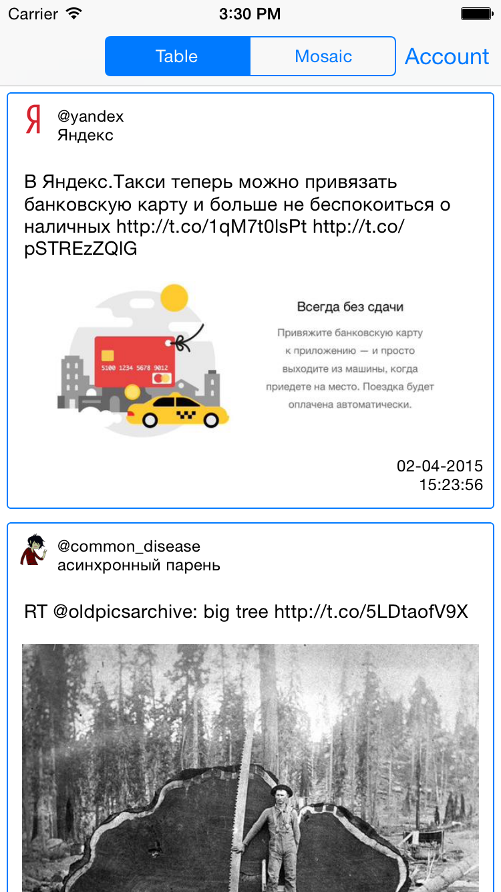
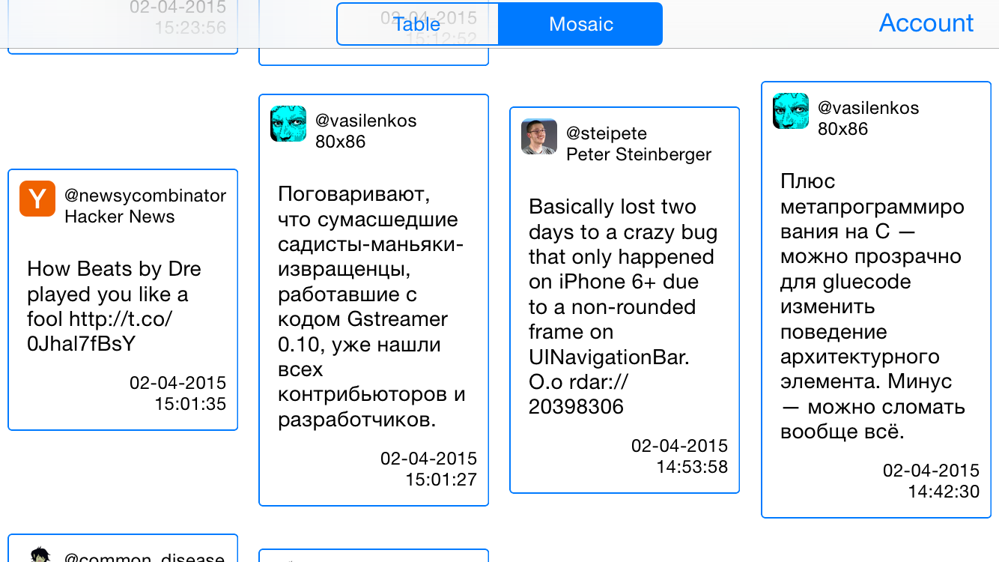

# TwitterReader

The example of how to do following:
- use NSURLProtocol and CoreData for caching
- implement pagination in UICollectionView
- load images in cells
- use Social framework for obtaining Twitter feed
- use UIAlertController
- ...

## Screenshots

Table mode:

Mosaic mode:

